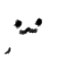

## About Me

Hello!! I code from time to time, mostly on small-ish passion projects like [Fridaylight](https://github.com/echolotl/fridaylight) or [Nationstage](https://github.com/echolotl/fridaylight)! I mostly do art, though, and you can check it out on my website (when it works). I am (somewhat) knowledgeable in a couple web frameworks, like **Vue**, **Svelte**, **Astro**, along with a couple languages such as **TypeScript/JavaScript**, **Rust**, and **Haxe**.

Also, it's pronounced like *axolotl* but with the "axo" replaced with "echo".